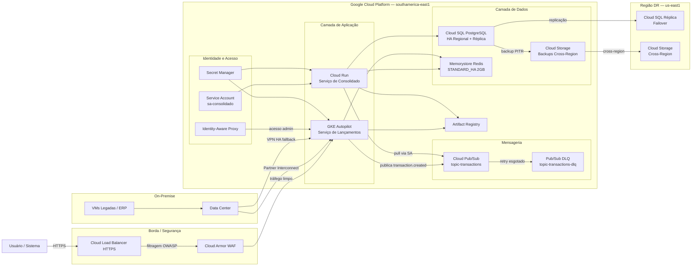

# Topologia Geral

```mermaid
graph LR
    subgraph OnPrem ["On-Premise"]
        DC["Data Center"]
        VM["VMs Legadas / ERP"]
    end

    subgraph Borda ["Borda / Segurança"]
        LB["Cloud Load Balancer HTTPS"]
        Armor["Cloud Armor WAF"]
    end

    subgraph GCP ["Google Cloud Platform — southamerica-east1"]
        subgraph Aplicacao ["Camada de Aplicação"]
            GKE["GKE Autopilot\nServiço de Lançamentos"]
            CloudRun["Cloud Run\nServiço de Consolidado"]
        end
        subgraph Mensageria ["Mensageria"]
            Pub["Cloud Pub/Sub\ntopic-transactions"]
            DLQ["Pub/Sub DLQ\ntopic-transactions-dlq"]
        end
        subgraph Dados ["Camada de Dados"]
            SQL["Cloud SQL PostgreSQL\nHA Regional + Réplica"]
            Redis["Memorystore Redis\nSTANDARD_HA 2GB"]
            Storage["Cloud Storage\nBackups Cross-Region"]
        end
        subgraph Seguranca ["Identidade e Acesso"]
            IAP["Identity-Aware Proxy"]
            SA["Service Account\nsa-consolidado"]
            SecMgr["Secret Manager"]
        end
        Artifact["Artifact Registry"]
    end

    subgraph DR ["Região DR — us-east1"]
        SQLReplica["Cloud SQL Réplica\nFailover"]
        StorageDR["Cloud Storage\nCross-Region"]
    end

    Usuario["Usuário / Sistema"] -->|HTTPS| LB
    LB -->|filtragem OWASP| Armor
    Armor -->|tráfego limpo| GKE

    DC -->|Partner Interconnect| GKE
    DC -->|VPN HA fallback| GKE
    VM --> DC

    GKE -->|publica transaction.created| Pub
    CloudRun -->|pull via SA| Pub
    SA --> CloudRun
    Pub -->|retry esgotado| DLQ

    CloudRun --> SQL
    CloudRun --> Redis
    GKE --> Redis

    SQL -->|backup PITR| Storage
    SQL -->|replicação| SQLReplica
    Storage -->|cross-region| StorageDR

    GKE --> Artifact
    CloudRun --> Artifact

    IAP -->|acesso admin| GKE
    SecMgr --> GKE
    SecMgr --> CloudRun
```