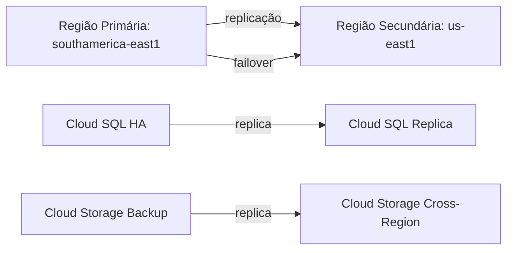

# Fluxo de DR

```mermaid
graph LR
  Primary["Região Primária: southamerica-east1"]
  Secondary["Região Secundária: us-east1"]
  SQLPrimary["Cloud SQL HA"]
  SQLSecondary["Cloud SQL Replica"]
  StoragePrimary["Cloud Storage Backup"]
  StorageSecondary["Cloud Storage Cross-Region"]

  Primary -->|replicação| Secondary
  SQLPrimary -->|replica| SQLSecondary
  StoragePrimary -->|replica| StorageSecondary
  Primary -->|failover| Secondary
```