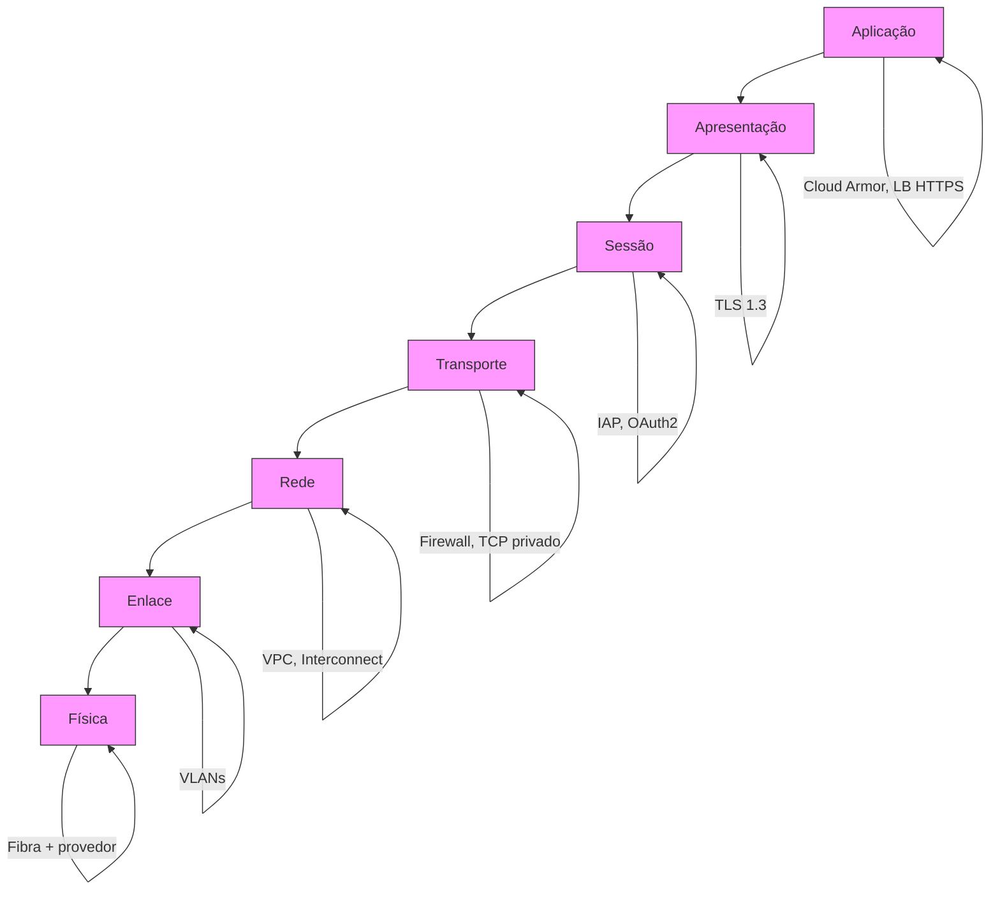

# Camadas OSI

```mermaid
graph TB
  L7["Aplicação"]
  L6["Apresentação"]
  L5["Sessão"]
  L4["Transporte"]
  L3["Rede"]
  L2["Enlace"]
  L1["Física"]
  L7 --> L6 --> L5 --> L4 --> L3 --> L2 --> L1
  L7:::component -->|Cloud Armor, LB HTTPS| L7
  L6:::component -->|TLS 1.3| L6
  L5:::component -->|IAP, OAuth2| L5
  L4:::component -->|Firewall, TCP privado| L4
  L3:::component -->|VPC, Interconnect| L3
  L2:::component -->|VLANs| L2
  L1:::component -->|Fibra + provedor| L1
  classDef component fill:#f9f,stroke:#333,stroke-width:1px;
```